# CookiesStore

 

- Cookies Store site, NodeJs, Express, HTML, JS, CSS, BootStrap, AJAX, JQuery, and other useful things includes multible npm usage here! 
- This project has been incredibly beneficial in enhancing my comprehension of the online shopping process, spanning from the order placement to delivery.
- Additionally, it introduced me to various npm packages, such as webhooks for Discord and session management, which proved to be highly valuable.

### List of Packages 📦 : ⚪ express, ⚪ http, ⚪ bodyParser, ⚪ mysql2, ⚪ express-session,

### ⚪ path, ⚪ sweetalert2, ⚪ WebHook, ⚪ os, ⚪ dns, ⚪ fs, ⚪ multer, ⚪ chokidar, ⚪ events , ⚪ EJS

### 🔗LinkedIn Link : https://www.linkedin.com/in/bashar-al-thawabta/

# 🟢 FEEL FREE TO USE THIS CODE! 🟢

### 🔴 NOTE 🔴

## Didn't set any sessions for the admin you can req the admin pages without login.

### User Pages:

## home page 🏠

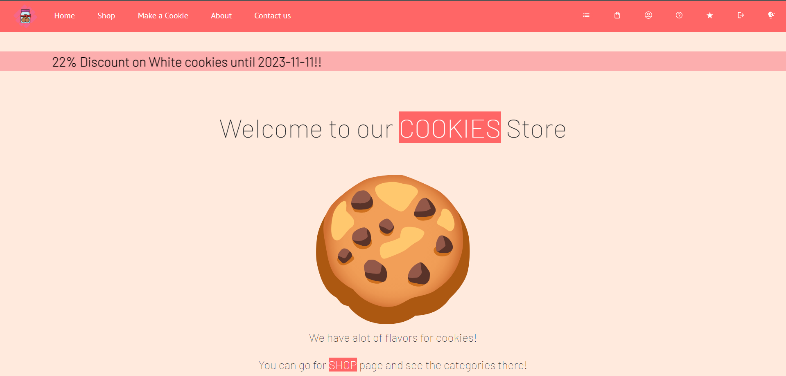
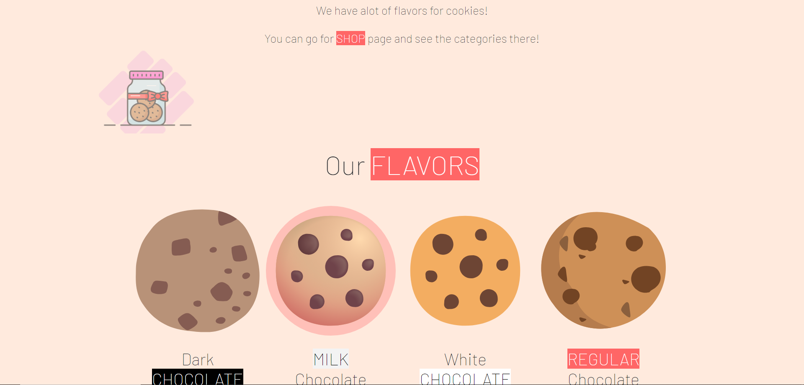
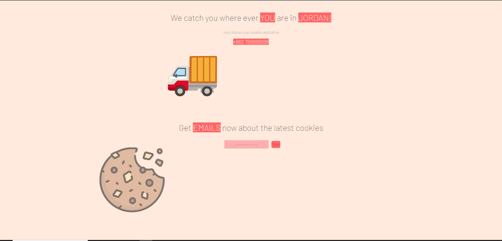

## shop Page 🛒

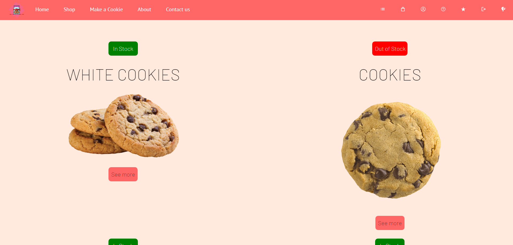

## coming soon

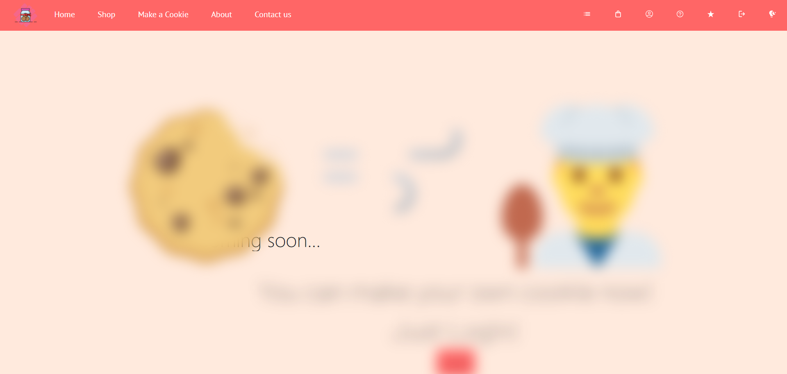

## About us Page

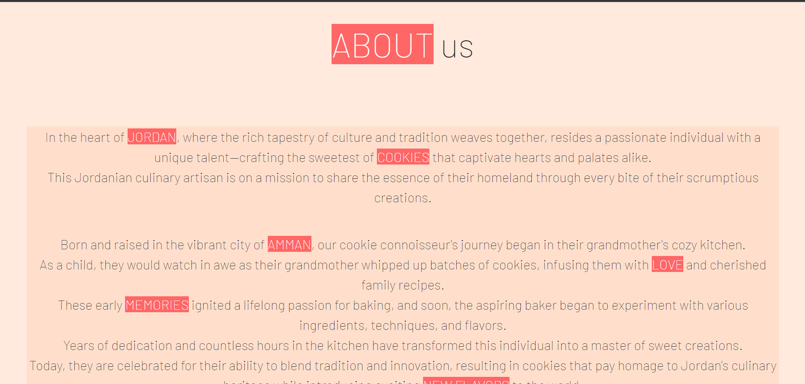

## contact us

## Feedback Page

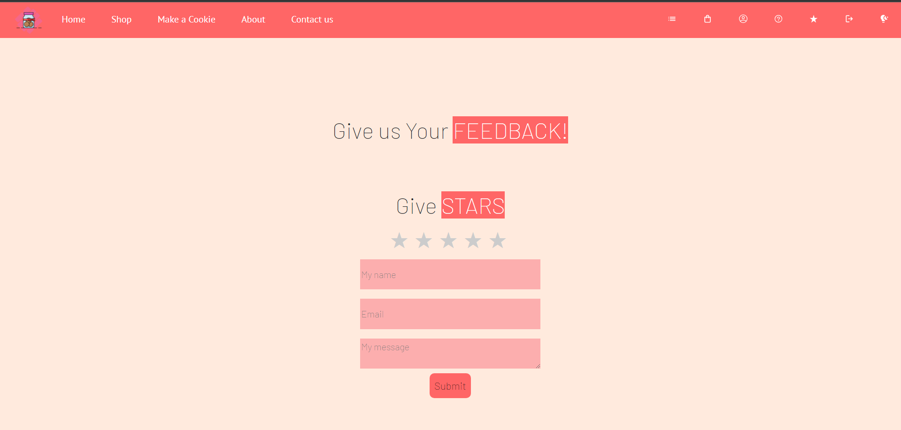

### Night Mode 🌑

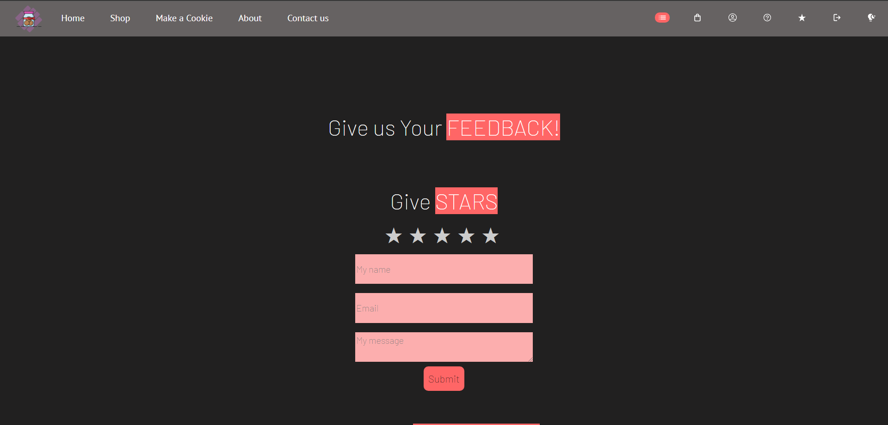

## Login Page

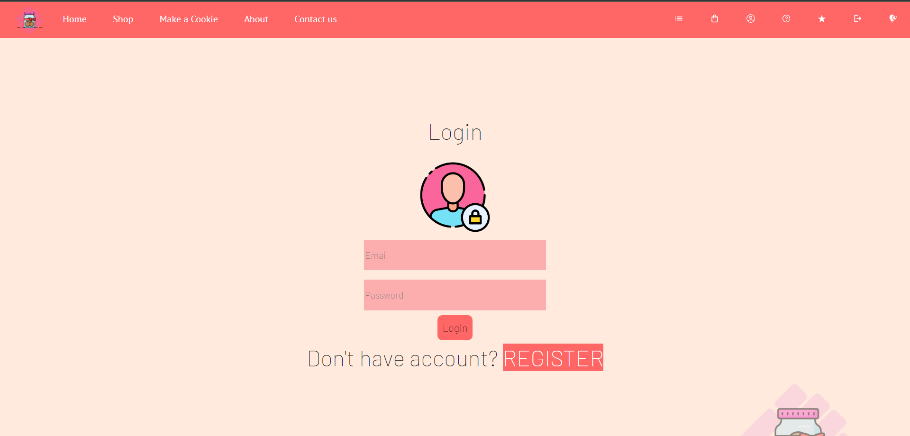

# Register Page

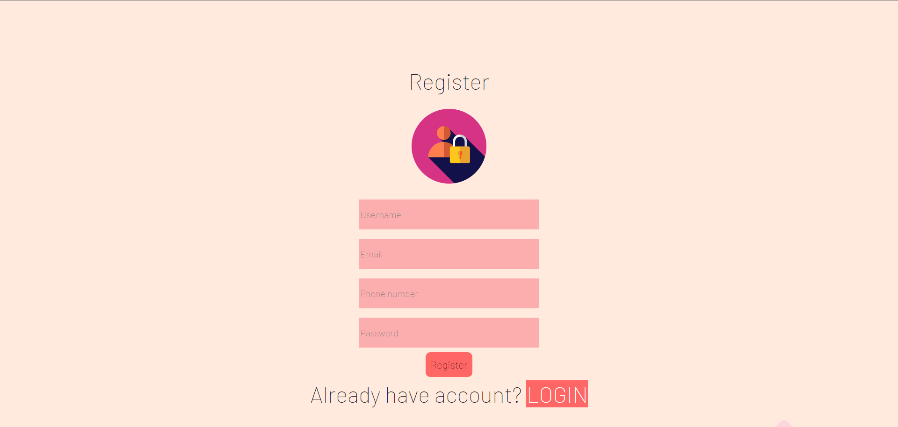

## Cart Before Login

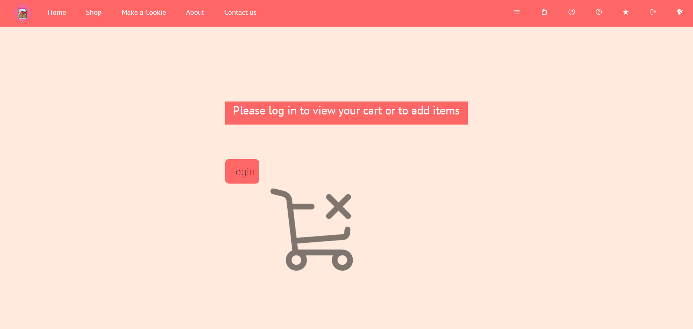

## Ordering

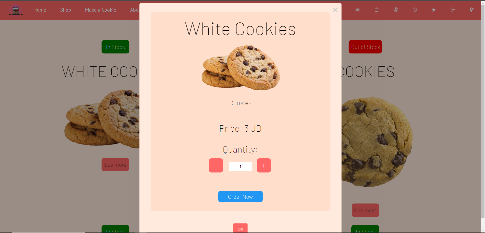

## Orderd

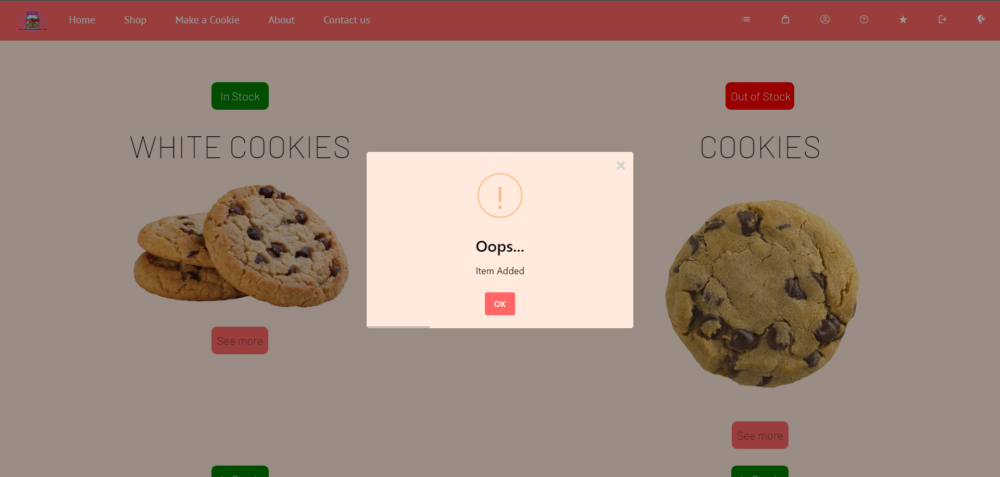

## User's Order Page

## My Orders

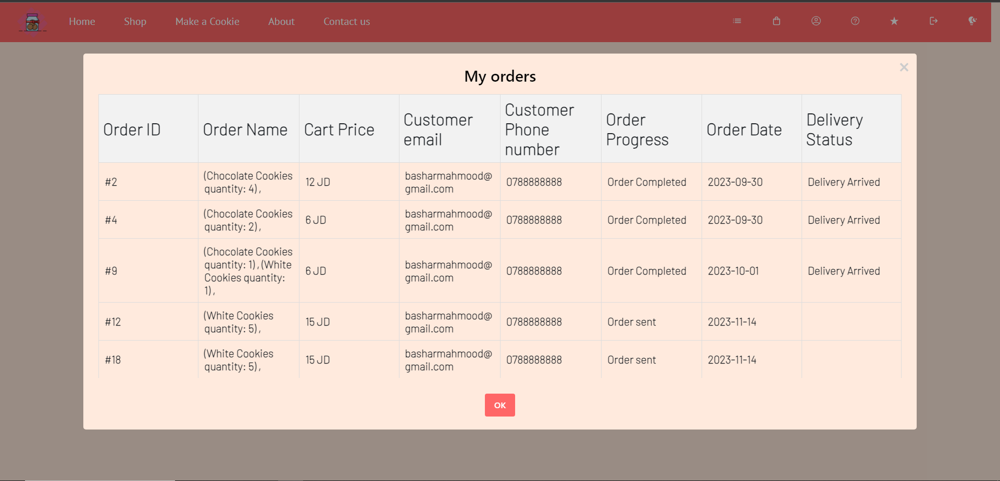
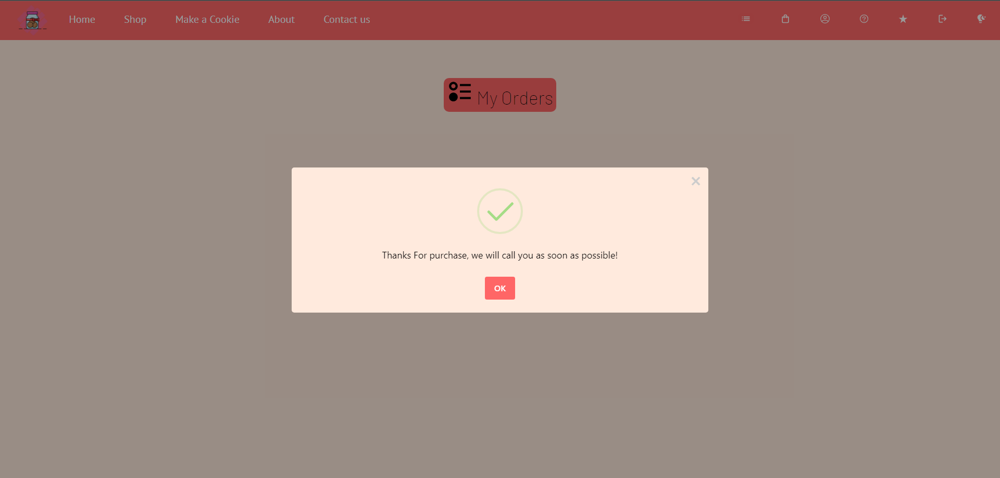
### Admin Pages:

## Contact us Messages

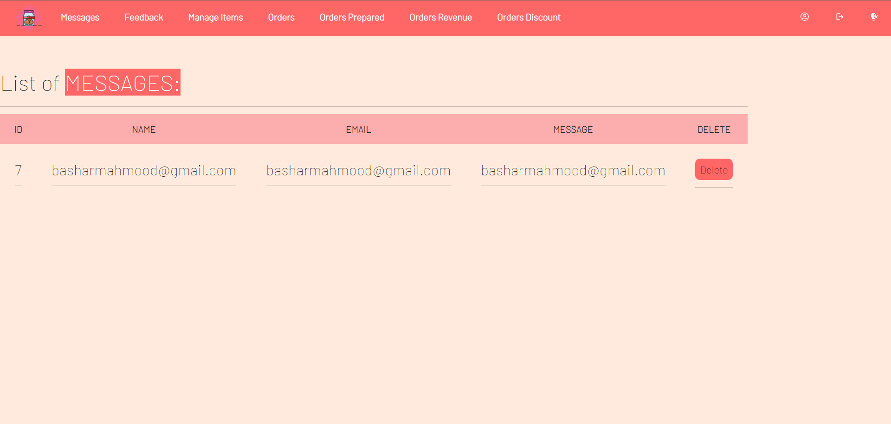

## Manage Items Page

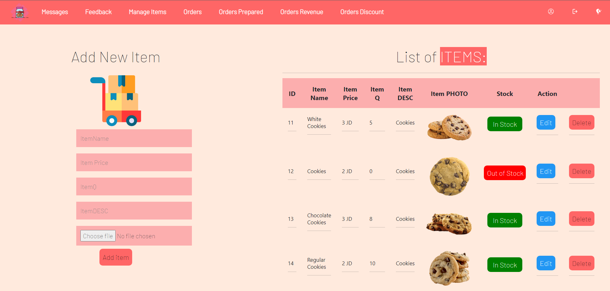

### Orders Tracking From Prepare The Order To Deliver It!

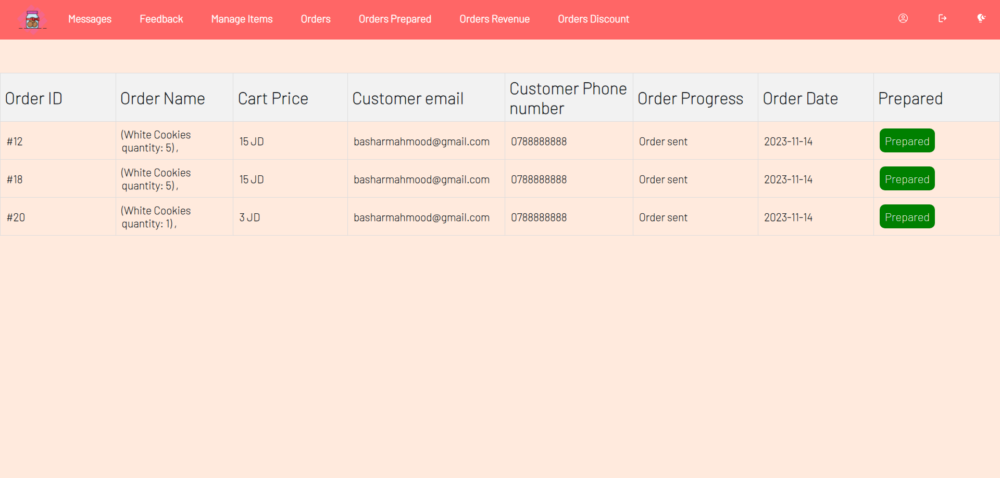
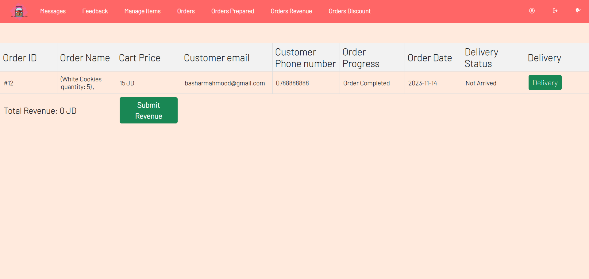
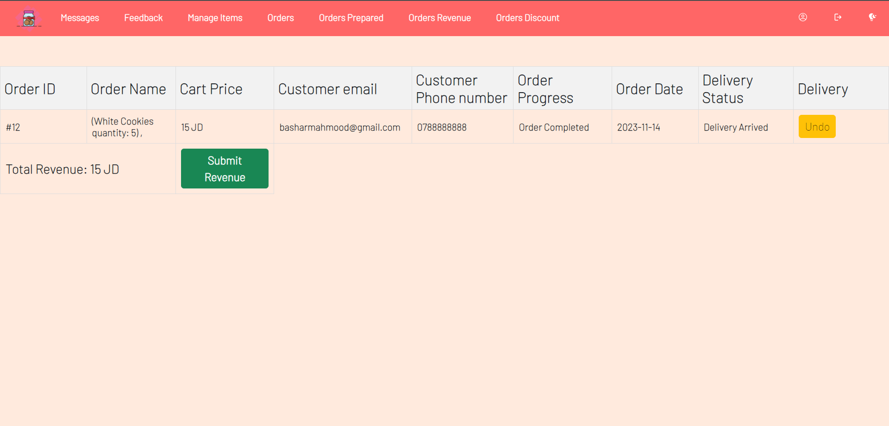
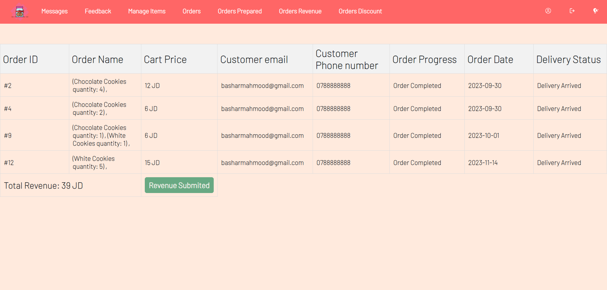
